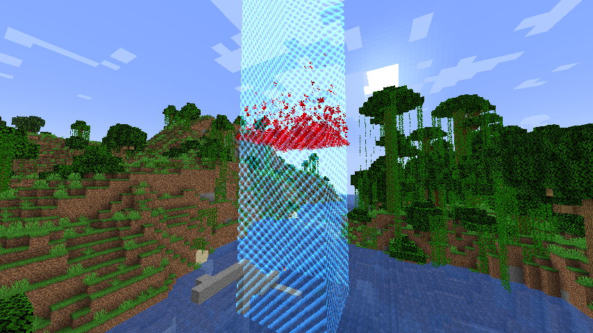
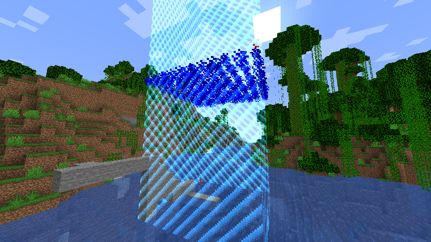

# HeightBorder
Minecraft plugin that implements a world border that stops players from being too high. 

For 1.19 version of minecraft.

Requires worldborderapi this can be found here:
https://github.com/yannicklamprecht/WorldBorderAPI/releases/tag/1.190.1

The primary idea for this plugin is for it to be used at the end of a UHC to stop players from camping
in sky bases and extending the game time too long.

The main command of the plugin is `/heightborder` or `/hb` and it currently has 4 sub commands:
`/hb create` Used for creating height borders
`/hb delete` Used for deleting height borders
`/hb list` Used to list all the attributes of all current height borders in the world
`/hb set` Used to set individual attributes of an already created border

# Create
The `/hb create` command currently requires 9 arguments after it to define the new border.
`/hb create <startHeight> <endHeight> <direction> <velocity(in blocks per min)> <x1> <z1> <x2> <z2> <type>`
For example `/hb create 256 128 down 60 5 5 -5 -5 break` would be a valid command
startHeight: the height that the border starts at
endHeight: the world height that the border stops moving at
direction: the positive direction of motion, applies affect in opposite direction,
for example with "down" players above the border will be damaged.
velocity: the rate at which the border moves, given in blocks per minute (60 would be 1 block per second)
x1/x2/z1/z2: Defines the square where the border will be displayed to, although currently the borders damage
will still affect the entire world.
type: can be either "break" or "damage": "break" will break blocks as the border moves through them, "damage" will damage
players outside the border. Once the border has been created each of these attributes can be changed, but they are imagined
to be mutually exclusive. 

# List
List all the borders, also gives their id's to help with deleting

# Delete
Give the number id of the border to delete it, the ids are only their position in the list so change when one is deleted

# Set
Set any of the following parameters:
            "currentheight",
            "endheight",
            "direction",
            "velocity",
            "pos1x",
            "pos1z",
            "pos2x",
            "pos2z",
            "damagePlayers",
            "breakBlocks",
            "displayBorderParticles",
            "damagepause",
            "numberofparticles"
Multiple parameters can be set at the same time with the same command:
for example `/hb set 1 currenheight 256 velocity 0 damagePlayers false` would be a valid command.

# Misc other features
Tab to complete
Borders persist over plugin/ server reload
Red screen tint warning: Currently being worked on, although having some issues with the 3rd party api
Finer tuning of display and break block timing

# Future plans
particle colours configuration
better animation for block breaking
Custom death messages from border

# Screenshots

